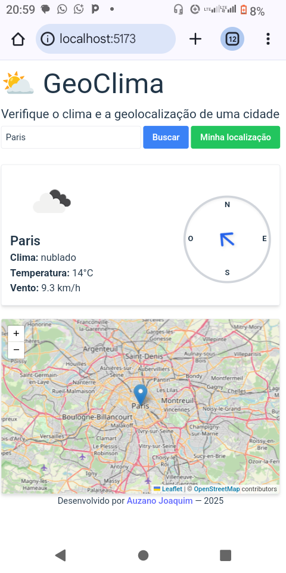
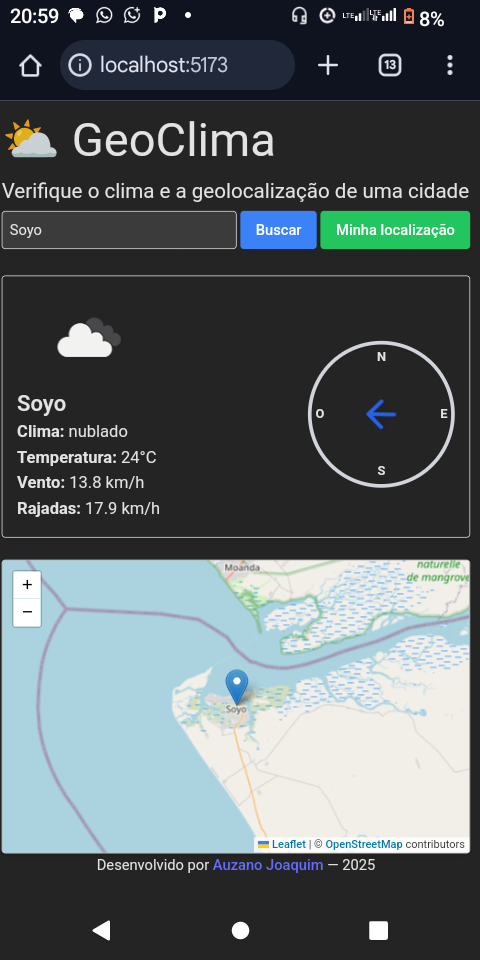

  

# 🌦️ GeoClima
# Geolocalização e Clima

Este é a versão mais atualizada do site [previsao-tempo](https://github.com/auzanojoaquim/previsao-tempo/), um app simples de previsão do tempo.  

Está realdadee foi construído com **React + Vite + TailwindCSS**. Permite pesquisar qualquer localidade e visualizar informações climáticas em tempo real, incluindo:    
🌡️ Temperatura,      
💧 Umidade,             
😶‍🌫️ Sensação térmica,  
🌬️ Velocidade do vento,  
🗺️ Localização no mapa.  

---

## 📸 Screenshots  
   <h5>Modo claro vs modo escuro</h5>
<div style="display: flex; grap: 10px; justify-content: center;">

  
</div>

---

## 🚀 Tecnologias Utilizadas  

    
    
  
    

---

## 📦 Como Rodar o Projeto  

Clone este repositório e instale as dependências:  

```bash
git clone https://github.com/auzanojoaquim/GeoClima.git  
cd GeoClima
npm install
```

Inicie o servidor de desenvolvimento:

```bash
npm run dev
```

O app ficará disponível em:👇
```
http://localhost:5173
```


---

🔑 Configuração da API

Este projeto utiliza a OpenWeather API.

1. Crie uma conta gratuita em OpenWeather.


2. Gere sua chave de API.


3. Crie um arquivo .env na raiz do projeto com o seguinte conteúdo:


```
VITE_API_KEY=SUA_CHAVE_AQUI
```

---

✨ Funcionalidades

✅ Pesquisa de local  
✅ Exibição da temperatura atual  
✅ Umidade e sensação térmica  
✅ Velocidade do vento em km/h  
✅ Interface intuitiva e responsiva    
✅ Suporte a modo claro/escuro    
✅ Mapa interativa (para geolocalização)

---

👨🏽‍💻👨🏽‍💻 Autor

Desenvolvido por [Auzano Joaquim ](https://github.com/auzanojoaquim)

---

📜 Licença


Este projeto está sob a licença MIT.
Sinta-se à vontade para usar, modificar e compartilhar!
